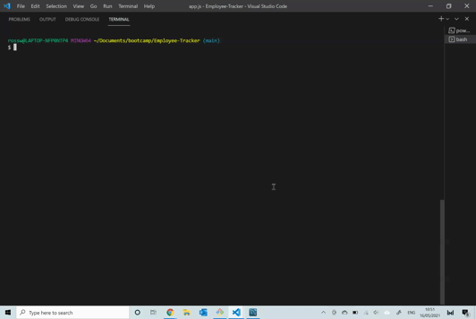

# Employee Tracker

## Summary
My task was to architect and build a solution for managing a company's employees using node, inquirer, and MySQL.

The application is able to:

  * Add departments, roles, employees

  * View departments, roles, employees

  * Update employee roles

  * Update employee managers

  * View employees by manager

  * Delete departments, roles, and employees

  * View the total utilized budget of a department -- ie the combined salaries of all employees in that department


## Demo


## Getting Started
### Instructions:
* First run npm install, to install all the relevent modules required to run the app.
* Next run npm start, to run the start script.

## Built With
* MySQL
* Express.js
* Node.js
* inquirer

## Code Snippet

The following code demonstrates the schema used for the database.

```
CREATE TABLE department (
    department_id INT AUTO_INCREMENT PRIMARY KEY,
    department_name VARCHAR(30) NOT NULL,
);

CREATE TABLE role (
    role_id INT AUTO_INCREMENT PRIMARY KEY,
    title VARCHAR(30) NOT NULL,
    salary DECIMAL(10, 2),
    department_id INT,
        FOREIGN KEY (department_id)
        REFERENCES department(department_id)
        ON DELETE CASCADE
);

CREATE TABLE employee (
    employee_id INT PRIMARY KEY,
    first_name VARCHAR(30),
    last_name VARCHAR(30),
    role_id INT NOT NULL,
    manager_id INT,
        FOREIGN KEY (role_id)
        REFERENCES role(role_id)
        ON DELETE CASCADE
);
```
## Authors
Ross White

## Questions
For any questions regarding this project, I can be contacted through:
* GitHub- <github.com/ross-white>
* Email- <rosswhite@outlook.com>